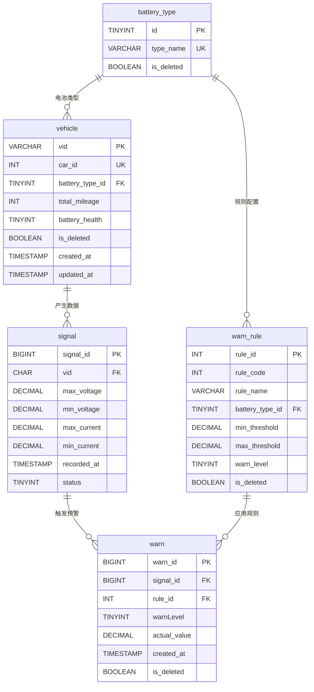

## 数据库表设计

根据需求将整体拆分成五个表：电池类型表，车辆表，信号表，预警规则表，预警表


​    




电池类型表：

```sql
CREATE TABLE battery_type (
    id TINYINT PRIMARY KEY AUTO_INCREMENT,
    type_name VARCHAR(20) NOT NULL UNIQUE COMMENT '电池类型名称',
		is_deleted BOOLEAN DEFAULT FALSE COMMENT '逻辑删除标志, false: 未删除, true: 已删除'
);
```

车辆表：

```sql
CREATE TABLE vehicle (
    vid VARCHAR(16) PRIMARY KEY COMMENT '车辆识别码',
    car_id INT NOT NULL UNIQUE COMMENT '车架编号',
    battery_type_id TINYINT NOT NULL COMMENT '电池类型ID',
    total_mileage INT UNSIGNED DEFAULT 0 COMMENT '总里程(km)',
    battery_health TINYINT UNSIGNED DEFAULT 100 COMMENT '电池健康状态(%)' 
        CHECK (battery_health >= 0 AND battery_health <= 100),
		is_deleted BOOLEAN DEFAULT FALSE COMMENT '逻辑删除标志, false: 未删除, true: 已删除',
    created_at TIMESTAMP DEFAULT CURRENT_TIMESTAMP,
    updated_at TIMESTAMP DEFAULT CURRENT_TIMESTAMP ON UPDATE CURRENT_TIMESTAMP,
    INDEX idx_battery_type (battery_type_id),
    FOREIGN KEY (battery_type_id) REFERENCES battery_type(id)
);
```

信号表：

```sql
CREATE TABLE `signal` (
signal_id BIGINT PRIMARY KEY AUTO_INCREMENT,
vid CHAR(16) NOT NULL,
max_voltage DECIMAL(6,3) COMMENT '最高电压Mx',
min_voltage DECIMAL(6,3) COMMENT '最小电压Mi',
max_current DECIMAL(6,3) COMMENT '最高电流Ix',
min_current DECIMAL(6,3) COMMENT '最小电流Ii',
recorded_at TIMESTAMP DEFAULT CURRENT_TIMESTAMP COMMENT '记录时间',
is_deleted BOOLEAN DEFAULT FALSE COMMENT '逻辑删除标志, false: 未删除, true: 已删除',
FOREIGN KEY (vid) REFERENCES vehicle(vid),
INDEX idx_vid_time (vid, recorded_at)
);
ALTER TABLE `signal`
CHANGE COLUMN is_deleted status TINYINT NOT NULL DEFAULT 0 COMMENT '状态: 0=正常, 1=已删除, 2=其他状态';
```


预警规则表：

```sql
CREATE TABLE warn_rule (
    rule_id INT PRIMARY KEY AUTO_INCREMENT COMMENT '规则ID',
    rule_code INT NOT NULL COMMENT '规则编号: 1=电压差报警, 2=电流差报警',
    rule_name VARCHAR(50) NOT NULL COMMENT '规则名称',
    battery_type_id TINYINT NOT NULL COMMENT '电池类型ID',
    min_threshold DECIMAL(6,3) NOT NULL COMMENT '最小阈值',
    max_threshold DECIMAL(6,3) NOT NULL COMMENT '最大阈值',
    warn_level TINYINT NOT NULL COMMENT '预警等级0-4',
		is_deleted BOOLEAN DEFAULT FALSE COMMENT '逻辑删除标志, false: 未删除, true: 已删除',
    FOREIGN KEY (battery_type_id) REFERENCES battery_type(id),
    INDEX idx_battery_code (battery_type_id, rule_code),
    INDEX idx_rule_code (rule_code)
);
```

警告表：

```sql
CREATE TABLE `warn` (
    warn_id BIGINT PRIMARY KEY AUTO_INCREMENT COMMENT '预警ID',
    car_id BIGINT NOT NULL COMMENT '车辆ID',
    bat_typename VARCHAR(50) NOT NULL COMMENT '电池类型名称',
    warnName VARCHAR(100) NOT NULL COMMENT '预警名称',
    warnLevel TINYINT NOT NULL COMMENT '预警等级',
    created_at TIMESTAMP DEFAULT CURRENT_TIMESTAMP COMMENT '创建时间',
    is_deleted BOOLEAN DEFAULT FALSE COMMENT '逻辑删除标志, false: 未删除, true: 已删除'
);
```

